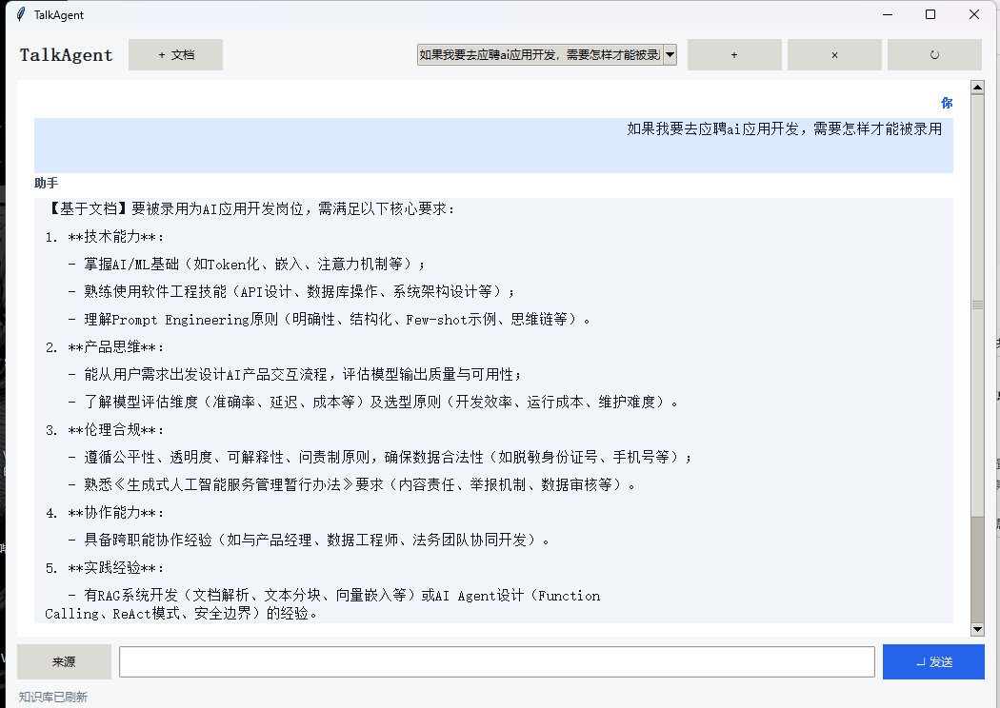
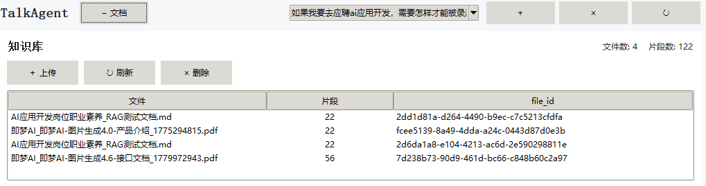
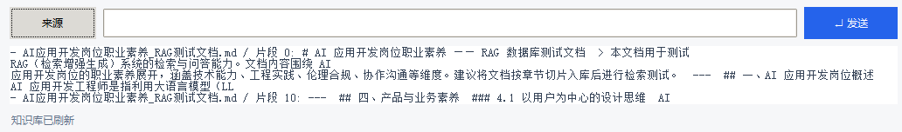
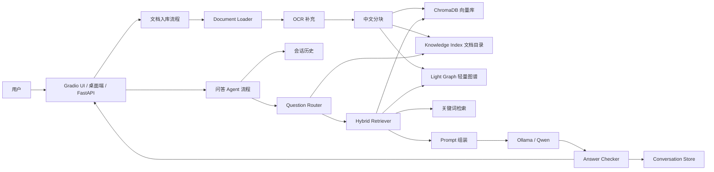

# TalkAgent

TalkAgent 是一个本地优先的 RAG 智能问答客服系统。用户可以上传 PDF、Word、Markdown、TXT 和图片资料，系统会构建私有知识库，并通过本地 Ollama 大模型结合检索片段回答问题。

当前版本已从基础向量 RAG 升级为 LightRAG-lite 思路的混合检索：向量召回、关键词召回和轻量实体图谱召回会融合排序，并在回答来源中展示分数和命中方法，方便定位答案依据与调试检索效果。

## 核心功能

- 多格式文档入库：支持 `.pdf`、`.docx`、`.txt`、`.md`、`.png`、`.jpg`、`.jpeg`。
- 私有知识库检索：使用 ChromaDB 持久化文档向量和 metadata。
- 本地大模型问答：默认通过 Ollama 调用 `codex-app` 模型。
- 中文文档分块：针对中文标点配置递归分块策略。
- OCR 增强：支持 RapidOCR、Ollama 视觉模型和 Tesseract 兜底。
- 问题路由：自动区分通用回答、文档回答、综合回答和缺少依据。
- 混合检索：融合 ChromaDB 向量检索、BM25 风格关键词检索和轻量图谱检索。
- LightRAG-lite 模式：支持 `naive`、`local`、`global`、`mix` 检索思路。
- 检索调试：UI 和 API 可返回 chunk、score、methods、vector/keyword/graph 分数。
- 多轮会话：会话记录保存到本地 JSON 文件。
- 来源追踪：回答可展示命中的文件、片段编号和摘要片段。
- 多入口使用：提供 Gradio Web UI、FastAPI API 和 Tk 桌面端。

## 可审计决策链路

每次问答都会生成独立 `trace_id`，将请求、历史上下文统计、路由结果、检索候选、最终上下文、回答校验、耗时和异常持久化到 `data/observability/traces.sqlite3`。开发者控制台支持按问题、文件名或片段内容搜索 Trace，并区分“仅考察的候选片段”和“实际送入模型上下文的片段”。

这是一条可复查的决策与执行记录，而不是展示模型原始思维链；界面输出的是可验证的输入、结构化判断、检索依据和操作结果。

- Web UI：启用“开发者模式”后，展开“开发者控制台”，选择某次 Trace 查看决策时间线和完整候选片段。
- API：`GET /api/traces?search=...` 搜索 Trace，`GET /api/traces/{trace_id}` 获取单次完整详情。

## 检索可靠性

系统不会再完全依赖路由模型决定是否检索。当初始路由判为通用问题、但知识库候选存在关键词、图谱或已验证的语义向量证据时，会自动切换到文档回答路径；证据不足则保留原路由，并将被排除的候选记录进 Trace。

开发者控制台的“Embedding 与索引健康状态”和 `GET /api/system-status` 会展示当前 embedding 后端、是否具备真实语义能力、向量指纹以及索引兼容状态。`HashEmbeddings` 仅用于保证离线流程可运行，不应视为语义检索；在 BGE-M3 权重就绪后必须重建已有索引。

## 演示截图

### 智能问答



### 知识库管理



### 来源追踪



## 架构图



更细的状态流和模块职责见 [docs/ARCHITECTURE.md](docs/ARCHITECTURE.md)。

面试讲解和项目复盘建议见 [docs/INTERVIEW_GUIDE.md](docs/INTERVIEW_GUIDE.md)。

## 目录结构

```text
talkagent/
├── app/                         # 主应用代码
│   ├── api.py                   # FastAPI 路由
│   ├── ui.py                    # Gradio Web UI
│   ├── desktop.py               # Tk 桌面端
│   ├── rag_chain.py             # RAG 问答编排
│   ├── question_router.py       # 问题路由
│   ├── answer_checker.py        # 回答事实自查
│   ├── document_loader.py       # 文档加载
│   ├── text_splitter.py         # 中文分块
│   ├── vector_store.py          # ChromaDB 封装
│   ├── hybrid_retrieval.py      # 向量、关键词、图谱混合检索
│   ├── light_graph.py           # 轻量实体图谱
│   ├── knowledge_index.py       # 文档摘要目录
│   ├── chat_store.py            # 会话 JSON 存储
│   ├── embedder.py              # BGE-M3 embedding 与兜底
│   ├── llm_client.py            # Ollama 调用
│   └── ocr.py                   # OCR 能力
├── data/                        # 本地运行数据
│   ├── uploads/                 # 上传文件
│   ├── chroma/                  # ChromaDB 持久化目录
│   ├── knowledge_index/         # 文档摘要和全局目录
│   ├── light_graph/             # 轻量图谱索引
│   └── conversations/           # 会话记录
├── docs/                        # 项目文档、截图和架构说明
│   └── images/                  # README 演示截图
├── tests/                       # 单元测试
├── models/                      # 本地模型缓存
├── scripts/                     # 报告和材料生成脚本
├── output/                      # 生成的报告、PPT、PDF
├── Dockerfile
├── docker-compose.yml
├── requirements.txt
└── README.md
```

更完整的目录维护说明见 [docs/PROJECT_STRUCTURE.md](docs/PROJECT_STRUCTURE.md)。

## 快速开始

1. 安装依赖：

```bash
pip install -r requirements.txt
```

2. 准备环境变量：

```bash
copy .env.example .env
```

3. 启动 Ollama，并确保 `.env` 中的 `LLM_MODEL` 可用：

```bash
ollama serve
ollama pull qwen3:1.8b
```

4. 启动 Web UI：

```bash
python run_talkagent_ui.py
```

默认访问地址是 `http://127.0.0.1:7860`。

## 其他启动方式

启动 FastAPI + Gradio：

```bash
python -m app.main
```

启动桌面端：

```bash
python -m app.desktop
```

使用 Docker Compose：

```bash
docker compose up --build
```

## 测试

项目补充了不依赖外部大模型和真实向量库的单元测试，覆盖会话存储、问题路由、中文分块、RAG 后处理辅助逻辑、混合检索和轻量图谱。

```bash
pip install -r requirements-dev.txt
```

```bash
python -m pytest -q
```

测试说明见 [docs/TESTING.md](docs/TESTING.md)。

## 关键配置

| 变量 | 默认值 | 说明 |
| --- | --- | --- |
| `OLLAMA_HOST` | `http://localhost:11434` | Ollama 服务地址 |
| `LLM_MODEL` | `codex-app` | 问答模型名称 |
| `EMBEDDING_MODEL` | `BAAI/bge-m3` | Embedding 模型 |
| `CHUNK_SIZE` | `500` | 文档分块大小 |
| `CHUNK_OVERLAP` | `100` | 分块重叠长度 |
| `RETRIEVAL_K` | `10` | 默认检索片段数 |
| `CHAT_HISTORY_ROUNDS` | `10` | 注入 Prompt 的最近对话轮数 |
| `ENABLE_OCR` | `true` | 是否启用 OCR |
| `ENABLE_VISION_OCR` | `true` | 是否启用视觉模型 OCR |

## 运行提示

- 当前代码默认允许 `HashEmbeddings` 作为本地 BGE-M3 权重不可用时的开发兜底。正式演示或效果评估前，建议补齐 BGE-M3 权重并重建 Chroma 索引。
- 文档入库会同时更新 ChromaDB、`data/knowledge_index/` 和 `data/light_graph/`，删除文档时也会同步删除目录摘要和图谱记录。
- Web UI 侧边栏的 Retrieval Test 可以对比 `mix`、`naive`、`local`、`global` 的召回效果；API 可调用 `/api/retrieval-test`。
- `CODE.md` 是历史交接文档，当前项目使用 README 和 `docs/` 作为主要说明入口。
