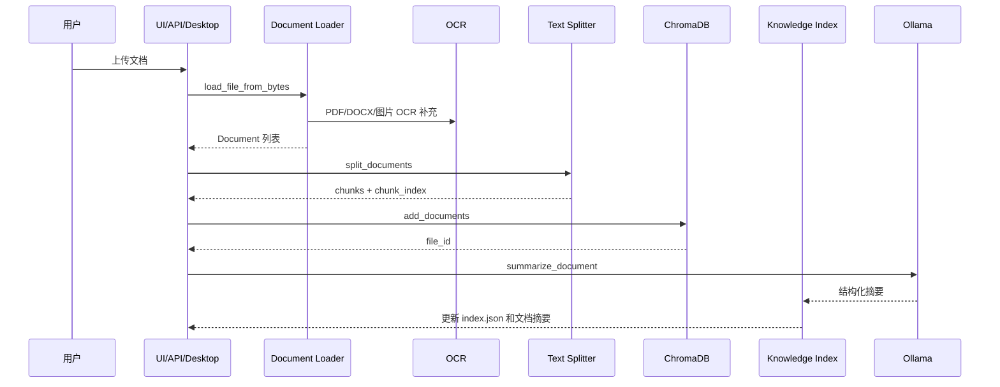
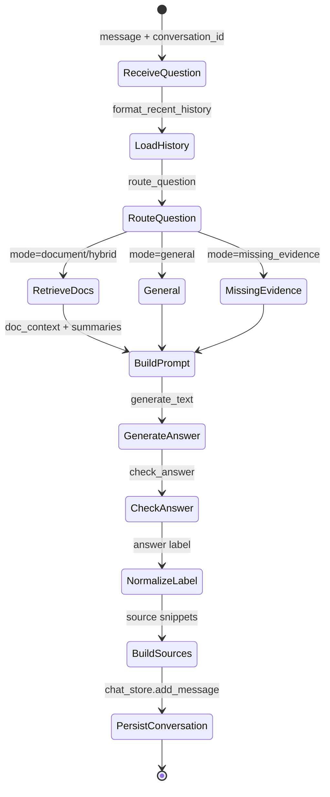

# TalkAgent 架构说明

本文档描述 TalkAgent 的模块职责、RAG 流程和 Agent 状态流。项目主题保持为“本地私有知识库智能客服”，核心目标是让用户上传资料后获得带来源的问答能力。

## 模块职责

| 模块 | 文件 | 职责 |
| --- | --- | --- |
| 入口层 | `app/ui.py`、`app/api.py`、`app/desktop.py` | Web UI、HTTP API、桌面端交互 |
| 文档加载 | `app/document_loader.py` | 保存上传文件并加载 PDF、Word、TXT、Markdown、图片 |
| OCR | `app/ocr.py` | 提取图片、扫描 PDF、DOCX 内图片中的文字 |
| 分块 | `app/text_splitter.py` | 按中文标点和换行切分文档 |
| 向量库 | `app/vector_store.py` | ChromaDB 增删查和统计 |
| 知识目录 | `app/knowledge_index.py` | 为文档生成结构化摘要和全局目录 |
| 路由器 | `app/question_router.py` | 判断问题是否需要文档依据 |
| RAG 编排 | `app/rag_chain.py` | 组织历史、路由、检索、生成、自检和来源 |
| 回答自检 | `app/answer_checker.py` | 对文档型回答做事实一致性检查 |
| 模型调用 | `app/llm_client.py` | 通过 LangChain Ollama 或原生 HTTP 调用模型 |
| 会话存储 | `app/chat_store.py` | JSON 文件持久化多轮对话 |

## 文档入库流程



## 问答 Agent 状态流

当前项目没有引入 LangGraph，Agent 状态由函数参数、局部变量和持久化文件组成。



主要状态字段：

- `question`：用户输入的问题。
- `conversation_id`：当前会话 ID。
- `history`：最近 N 轮对话文本。
- `route`：路由结果，包含 `mode`、`needs_documents`、`relevant_file_ids`。
- `docs`：检索得到的文档片段。
- `doc_context`：拼接后的检索上下文。
- `doc_summaries`：相关文档摘要。
- `answer`：模型生成并自检后的最终回答。
- `sources`：展示给用户的来源片段。

## 数据持久化

```text
data/
├── uploads/             # 原始上传文件
├── chroma/              # ChromaDB 持久化向量索引
├── knowledge_index/     # index.json + 每个文档的 markdown 摘要
└── conversations/       # 每个会话一个 JSON 文件
```

## 核心设计亮点

- 本地优先：文档、向量、对话和模型调用均可在本机运行。
- 双层知识组织：ChromaDB 负责片段检索，`knowledge_index` 负责文档级路由和摘要。
- 可解释回答：回答返回 `sources`，便于在 UI 中展示出处。
- 多端复用：Web、API、桌面端共用同一套入库和 RAG 函数。
- OCR 增强：普通文本抽取之外，补充扫描件和图片资料处理能力。

## 后续重构方向

- 把入库流程抽成 `IngestionService`，避免 UI/API/Desktop 重复调用底层函数。
- 把问答流程抽成显式 `AgentState`，让路由、检索、生成、自检更容易测试。
- 为 ChromaDB、知识目录和上传文件加入一致性保护。
- 将 `HashEmbeddings` 限定为开发兜底，并在生产模式下显式报错。

