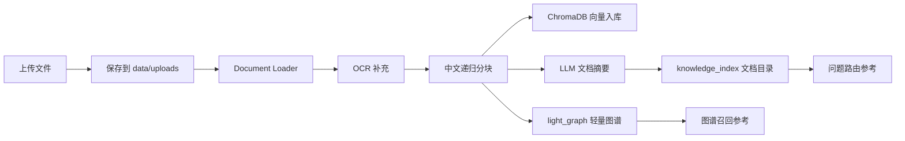
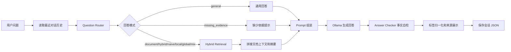

# TalkAgent 面试讲解手册

这份文档用于快速理解 TalkAgent 项目，并把它转化成面试中可以清楚表达的项目经历。建议面试前按“项目概述 -> 技术架构 -> 核心链路 -> 亮点 -> 痛点与方案 -> 面试问答”的顺序准备。

## 30 秒项目介绍

TalkAgent 是一个本地优先的 RAG 智能客服系统。用户可以上传 PDF、Word、Markdown、TXT 和图片资料，系统会把资料保存到本地知识库，经过文档解析、OCR、中文分块、向量入库、文档摘要和轻量图谱构建后，支持带来源的多轮问答。

项目的核心价值是：在不依赖云端知识库的前提下，用本地 Ollama 大模型、ChromaDB 向量库、关键词检索和轻量实体图谱，实现一个可演示、可扩展、可解释的私有知识库客服助手。

## 项目定位

- 目标用户：需要把企业资料、产品文档、接口文档、售后政策等私有资料做成本地问答系统的团队。
- 解决问题：文档分散、人工查找慢、大模型容易编造、私有资料不适合直接上传第三方平台。
- 核心能力：本地文档入库、混合检索、问题路由、带来源回答、会话管理、多端访问。
- 技术关键词：Python、FastAPI、Gradio、Tkinter、LangChain、ChromaDB、Ollama、BGE-M3、OCR、RAG、LightRAG-lite。

## 技术栈

| 层级 | 技术 | 作用 |
| --- | --- | --- |
| 交互层 | Gradio、FastAPI、Tkinter | Web UI、HTTP API、桌面端 |
| 文档处理 | PyPDF、docx2txt、TextLoader、PIL | PDF、Word、文本和图片读取 |
| OCR | RapidOCR、Ollama Vision、Tesseract | 图片、扫描 PDF、DOCX 内图片文字提取 |
| 分块 | LangChain RecursiveCharacterTextSplitter | 面向中文标点和换行的递归分块 |
| 向量库 | ChromaDB | 本地持久化向量索引和 metadata |
| Embedding | BGE-M3、HashEmbeddings fallback | 语义向量生成，开发环境可离线兜底 |
| 生成模型 | Ollama、本地 Qwen/codex-app | 回答生成、路由、摘要、自检 |
| 存储 | 本地文件系统 JSON/Markdown | 上传文件、知识目录、图谱、会话记录 |
| 测试 | pytest | 不依赖外部大模型的核心逻辑回归 |

## 核心目录

```text
app/
├── api.py                # FastAPI 接口
├── ui.py                 # Gradio Web UI
├── desktop.py            # Tk 桌面端
├── document_loader.py    # 文件保存和文档加载
├── ocr.py                # OCR 抽取
├── text_splitter.py      # 中文分块
├── vector_store.py       # ChromaDB 增删查
├── hybrid_retrieval.py   # 向量、关键词、图谱混合检索
├── light_graph.py        # 轻量实体图谱索引
├── knowledge_index.py    # 文档摘要和全局目录
├── question_router.py    # 问题路由
├── rag_chain.py          # RAG 问答编排
├── answer_checker.py     # 回答事实自检
├── llm_client.py         # Ollama 调用
└── chat_store.py         # 多轮会话存储
```

运行数据统一放在 `data/`，例如上传文件、Chroma 索引、知识目录、轻量图谱和会话记录。这些目录不作为代码提交，方便保护用户数据。

## 文档入库链路



关键细节：

- `document_loader.py` 负责按扩展名加载 PDF、DOCX、TXT、Markdown 和图片。
- `ocr.py` 对图片、扫描 PDF、DOCX 内嵌图片做 OCR，优先 RapidOCR，其次 Ollama 视觉模型，最后 Tesseract。
- `text_splitter.py` 使用中文标点、换行和空格作为分隔符，给每个 chunk 增加 `chunk_index`。
- `vector_store.py` 写入 ChromaDB，并在 metadata 中保存 `file_id`、`file_name`。
- `knowledge_index.py` 为文档生成结构化摘要，用于路由时判断“哪个文档可能回答这个问题”。
- `light_graph.py` 从 chunk 中抽取关键词、实体和邻近关系，写入 `data/light_graph/index.json`。

## 问答链路



回答模式：

- `general`：通用知识问题，不强制查文档。
- `document`：必须依据文档回答，内部映射为偏向向量和关键词的 `naive` 检索。
- `hybrid`：文档事实 + 通用解释，内部映射为 `mix` 检索。
- `missing_evidence`：需要业务依据但目录中没有匹配文档，拒绝编造。
- `naive`：偏基础 chunk 检索。
- `local`：更偏局部实体、关键词和图谱命中。
- `global`：更偏全局主题、摘要和关系召回。
- `mix`：向量、关键词、图谱三路融合。

## 混合检索设计

`hybrid_retrieval.py` 将三种召回结果合并：

1. 向量检索：调用 ChromaDB `similarity_search_with_score`，适合语义相近但字面不同的问题。
2. 关键词检索：实现 BM25 风格打分，适合接口参数、字段名、专有名词、精确词命中。
3. 轻量图谱检索：从 `light_graph` 命中实体、关键词和关系，适合实体相关、局部关联和主题召回。

融合结果会写入 metadata：

- `retrieval_score`：最终融合分数。
- `retrieval_methods`：命中的方法，例如 `vector`、`keyword`、`graph`。
- `vector_score`、`keyword_score`、`graph_score`：各路归一化分数。
- `graph_matched_terms`：图谱命中的实体或关键词。

面试讲法：

> 单纯向量检索对专有名词和参数表不稳定，所以我引入关键词召回补足精确匹配，再加一个轻量实体图谱模拟 LightRAG 的 local/global 思路。最后用加权融合排序，并把每一路分数暴露出来，方便调试为什么命中这个片段。

## API 能力

| 方法 | 路径 | 说明 |
| --- | --- | --- |
| `POST` | `/api/upload` | 上传文档，完成解析、分块、向量入库、摘要和图谱构建 |
| `GET` | `/api/documents` | 查看文档列表和知识库统计 |
| `DELETE` | `/api/documents/{file_id}` | 删除文档，同时删除向量、摘要和图谱 |
| `POST` | `/api/chat` | 多轮问答 |
| `POST` | `/api/retrieval-test` | 检索调试，返回 chunk、分数和命中方法 |
| `GET` | `/api/conversations` | 查看会话列表 |
| `GET` | `/api/conversations/{conversation_id}` | 查看会话详情 |
| `DELETE` | `/api/conversations/{conversation_id}` | 删除会话 |

## 项目优点

### 1. 本地优先，适合私有知识库

文档、向量、图谱和会话都在本机 `data/` 下持久化，模型默认走本地 Ollama，适合对隐私敏感的客服、售后、企业知识库场景。

### 2. 多格式资料入库

支持 PDF、Word、Markdown、TXT 和图片，OCR 可以补足扫描件、截图、DOCX 内图片等普通文本抽取覆盖不到的内容。

### 3. 不是单一路径 RAG

项目从基础向量 RAG 升级成了向量、关键词、轻量图谱混合检索，对中文文档、接口参数、专有名词和主题关系都有更好的覆盖。

### 4. 有问题路由和回答自检

`question_router.py` 先判断问题是否需要文档依据，`answer_checker.py` 再检查回答是否忠于上下文，降低“把通用知识说成文档事实”的风险。

### 5. 来源可解释

回答会返回来源文件、chunk 编号、片段摘要、检索方法和分数，方便用户追溯答案依据，也方便开发者调优检索。

### 6. 多端复用

同一套核心逻辑被 Gradio、FastAPI 和 Tk 桌面端复用，既能本地演示，也能作为 API 集成到其他系统。

### 7. 对开发环境友好

当 BGE-M3 权重不可用时，`HashEmbeddings` 可以作为离线兜底，让开发和单元测试不被模型下载卡住。

### 8. 有测试和文档沉淀

测试覆盖会话、路由、分块、RAG 辅助逻辑、混合检索和轻量图谱。文档包括 README、架构说明、测试说明、LightRAG-lite 路线和面试手册。

## 痛点、原因和解决方案

| 痛点 | 当前原因 | 解决方案 |
| --- | --- | --- |
| 检索质量仍依赖 chunk 命中 | 当前主要是固定字符分块，长文档可能语义断裂 | 引入 parent-child chunk、标题层级切分、Markdown/PDF/接口文档专用切分策略 |
| 缺少真正 reranker | 当前是三路召回后的加权融合，没有交叉编码器重排 | 加入 `BAAI/bge-reranker-base` 或轻量 reranker，对 top 30 重排到 top 6 |
| 轻量图谱较粗糙 | 当前实体和关系是启发式抽取，不是真正语义级知识图谱 | 用 LLM 结构化抽取 `entities`、`relations`、`facts`，并做去重、合并、置信度记录 |
| 入库一致性风险 | 向量库、摘要目录、图谱是多个存储，某一步失败可能不一致 | 抽象 `IngestionService`，加入事务式补偿、状态表和一键 rebuild |
| 大模型不可用时体验下降 | Ollama 服务和模型加载受本机资源影响 | 增加健康检查、模型预热、超时提示、流式输出和可配置模型降级 |
| HashEmbeddings 不适合生产 | 哈希向量只能用于开发兜底，语义效果有限 | 生产环境关闭 fallback，强制检查 BGE-M3 权重并重建索引 |
| OCR 速度和依赖复杂 | OCR 涉及 RapidOCR、Vision、Tesseract、多页 PDF 渲染 | 做异步任务队列、OCR 缓存、页数限制、进度展示和失败原因展示 |
| 缺少权限和多用户隔离 | 当前是本地个人工具形态 | 增加登录鉴权、workspace_id、用户级数据目录和 API token |
| 评测体系还不完整 | 目前测试偏单元逻辑，缺少真实 RAG 效果评估 | 建立问题-答案-来源评测集，记录 hit@k、MRR、引用完整率和人工评分 |
| 代码里有历史重复目录 | `app/app/` 是历史复制目录，当前运行以顶层 `app/` 为准 | 确认启动脚本和 Docker 不依赖后，单独提交清理重复目录 |

## 面试高频问题回答

### Q1：这个项目和普通 Chatbot 有什么区别？

普通 Chatbot 主要依赖模型自身知识，容易回答过时或编造的业务信息。TalkAgent 先把私有文档入库，回答时通过路由和检索把相关片段注入 Prompt，并在答案里返回来源，所以更适合客服、政策、接口文档这类需要依据的场景。

### Q2：为什么不用纯向量检索？

纯向量检索对语义相似问题效果不错，但对字段名、接口参数、型号、价格、专有名词这类精确词不稳定。所以项目加入 BM25 风格关键词检索，又加入轻量图谱召回，最后做融合排序，提高召回覆盖面。

### Q3：LightRAG-lite 体现在哪里？

LightRAG 的核心思路是把传统 chunk 检索和图谱结构结合起来，支持 naive、local、global、mix 等检索方式。TalkAgent 没有完整复刻 LightRAG，而是在本地轻量实现中加入实体/关键词/关系索引，并把路由模式扩展到 `naive/local/global/mix`，做到可演示、低依赖、易维护。

### Q4：如何降低大模型幻觉？

项目做了四层控制：第一层是问题路由，判断是否必须查文档；第二层是检索上下文和文档摘要注入；第三层是 Answer Checker 对文档型回答做事实自检；第四层是来源展示和标签归一化，让用户知道回答是通用回答、基于文档、综合回答还是缺少依据。

### Q5：如果上传的是扫描 PDF 或图片怎么办？

入库时会调用 OCR。优先使用 RapidOCR，本地视觉模型可用时用 Ollama Vision 兜底，最后尝试 Tesseract。如果 OCR 不可用，会生成占位文档说明原因，避免系统静默丢失图片信息。

### Q6：如果模型或 embedding 权重不可用怎么办？

生成模型不可用时，问答链路会返回检索到的文档片段摘要和错误原因。Embedding 方面，开发环境允许使用 HashEmbeddings 兜底，保证功能能跑通；生产环境建议关闭兜底，强制使用 BGE-M3 并重建索引。

### Q7：你会如何评估这个 RAG 系统？

我会准备一组覆盖事实问答、参数列表、跨文档问题、缺少依据问题的测试集。检索层看 hit@k、MRR、正确文件命中率；生成层看答案准确率、引用完整率、是否编造；工程层看响应时间、OCR 耗时、索引构建耗时和失败率。

### Q8：如果要上线，你会怎么改？

我会先拆出 `IngestionService` 和 `RetrievalService`，做入库状态管理和索引一致性保障；然后加鉴权、多用户 workspace、日志和监控；模型侧加健康检查、预热和流式输出；最后用 Docker volume 持久化 `data/`、`models/`，并建立定期评测集。

## 简历写法参考

- 设计并实现本地优先的 RAG 智能客服系统，支持 PDF、Word、Markdown、TXT、图片等多格式文档入库和带来源问答。
- 基于 ChromaDB、BGE-M3/Ollama 和 LangChain 构建私有知识库，支持中文分块、OCR 增强、多轮会话和文档级问题路由。
- 将基础向量 RAG 升级为 LightRAG-lite 混合检索，融合向量召回、BM25 风格关键词召回和轻量实体图谱召回，并输出检索分数和命中方法用于调试。
- 设计回答自检和来源追踪机制，降低文档型问答中的幻觉风险，提高答案可解释性。
- 提供 Gradio Web UI、FastAPI 接口和 Tk 桌面端，并补充 pytest 单元测试和架构文档，提升项目可演示性和可维护性。

## 面试讲解顺序

1. 先讲业务场景：私有资料问答、客服知识库、本地部署。
2. 再讲入库链路：文档加载、OCR、分块、向量库、摘要目录、轻量图谱。
3. 再讲问答链路：历史、路由、混合检索、Prompt、生成、自检、来源。
4. 然后讲亮点：本地优先、混合检索、可解释、多端复用、测试文档完善。
5. 最后主动讲不足和下一步：reranker、语义分块、图谱结构化、服务层抽象、多用户和评测体系。

## 演示建议

1. 启动 Web UI：`python run_talkagent_ui.py`。
2. 上传一份 Markdown/TXT 接口文档或产品说明。
3. 在 Retrieval Test 中分别用 `mix`、`naive`、`local`、`global` 看召回差异。
4. 提问一个文档内事实问题，展示回答标签和来源片段。
5. 提问一个文档没有的问题，展示系统如何进入缺少依据或通用回答。
6. 打开 `data/knowledge_index/` 和 `data/light_graph/index.json`，说明摘要目录和轻量图谱如何辅助检索。

## 当前可继续优化的优先级

1. 引入 reranker，这是最直接提升问答准确率的改动。
2. 做 parent-child chunk，改善长文档上下文不完整问题。
3. 把入库流程抽成服务层，解决 UI/API 重复和索引一致性问题。
4. 增加真实 RAG 评测集，让优化有数据依据。
5. 清理历史重复目录 `app/app/`，降低维护成本。
